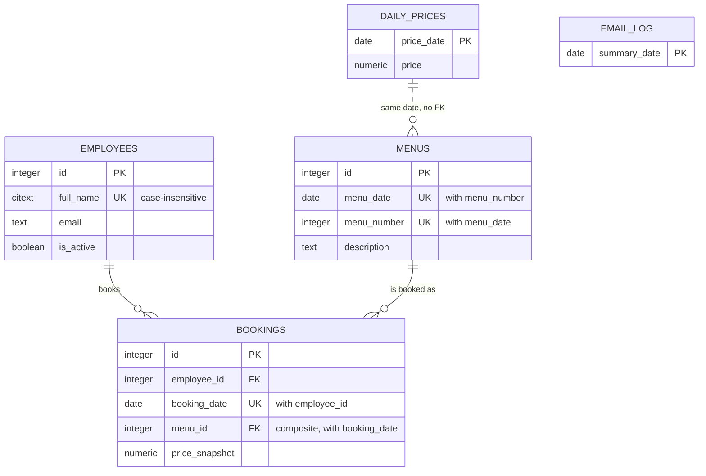

# LunchOrganizer — Database Schema Reference (V2)

> **Status: submitted for validation.**
> This document is the deliverable for checkpoint **V2** (`Docs/IMPLEMENTATION_PLAN.md` §5.3, §7). It describes the EF Core model and the generated migration exactly as implemented — nothing here is aspirational. `Scripts/create_database.sql` is deliberately **not** written yet; it is produced only after this schema is approved.

- **Database:** `lunchorganizer` · **Schema:** `public` · **Engine:** PostgreSQL 16, via Npgsql.EntityFrameworkCore.PostgreSQL 10.0.3
- **Source of truth in code:** `src/LunchOrganizer.Data/Configurations/*.cs` (one `IEntityTypeConfiguration<T>` per entity), wired up in `src/LunchOrganizer.Data/LunchOrganizerDbContext.cs`
- **Migration:** `src/LunchOrganizer.Data/Migrations/20260812075601_InitialCreate.cs`
- **Entities (frozen contracts, not modified in this run):** `src/LunchOrganizer.Domain/Entities/*.cs`

---

## 1. Tables — purpose, columns, constraints

### 1.1 `employees`

**Purpose.** One row per person who can book lunch. Names are unique regardless of case ("Massimo Fauro" and "massimo fauro" are the same person) so autocomplete and booking never create accidental duplicates. Employees are never hard-deleted once they have booking history — see §3.

| Column | Type | Nullable | Constraint | Meaning |
|---|---|---|---|---|
| `id` | `integer` (identity, `GENERATED ALWAYS`) | No | PK | Surrogate key. |
| `full_name` | `citext` | No | UNIQUE (`ix_employees_full_name`) | Display/search name. `citext` makes equality and the unique constraint case-insensitive at the database level — the guarantee does not depend on application code normalising case. |
| `email` | `text` | Yes | — | Optional, not currently used for login (booking is anonymous by name). |
| `is_active` | `boolean` | No | DEFAULT `true` | `false` = deactivated (soft-deleted): disappears from autocomplete, history and reports stay intact. |
| `created_at_utc` | `timestamptz` | No | DEFAULT `now()` | Audit; set once at the database, never by application code. |
| `updated_at_utc` | `timestamptz` | No | DEFAULT `now()` | Audit; the plan's default is a floor value from creation — the application updates this on every write. |
| *(xmin)* | system column | — | concurrency token | See §4. Not a real column; costs nothing, appears in no `CREATE TABLE`. |

### 1.2 `daily_prices`

**Purpose.** The price of lunch on a given calendar day, identical across all menus of that day. A day with no row uses `App:DefaultLunchPrice` from configuration — this table intentionally does not need a row for every day.

| Column | Type | Nullable | Constraint | Meaning |
|---|---|---|---|---|
| `price_date` | `date` | No | PK | The day the price applies to. |
| `price` | `numeric(10,2)` | No | CHECK `price >= 0` (`ck_daily_prices_price_non_negative`) | Exact decimal money, never `double`. |
| `created_at_utc` / `updated_at_utc` | `timestamptz` | No | DEFAULT `now()` | Audit. |
| *(xmin)* | system column | — | concurrency token | See §4. |

No foreign key to `menus` or `bookings` — a price may exist before any menu does, and past bookings keep their own frozen `price_snapshot` regardless of later price edits (plan §1.3).

### 1.3 `menus`

**Purpose.** A specific numbered menu offered on a specific date — "Menu 2 on Tuesday 18 August" is a distinct row from "Menu 2 on Monday 17 August" (plan §1.1). Admin-only CRUD; the booking page only reads this table.

| Column | Type | Nullable | Constraint | Meaning |
|---|---|---|---|---|
| `id` | `integer` (identity) | No | PK | Surrogate key. |
| `menu_date` | `date` | No | part of `ix_menus_menu_date_menu_number`, `ix_menus_menu_date`, `AK_menus_id_menu_date` | The day this menu is offered. |
| `menu_number` | `integer` | No | CHECK `menu_number >= 1` (`ck_menus_menu_number_positive`) | The label ("Menu 1/2/3…") and display order. |
| `description` | `text` | Yes | — | Optional content, per spec. |
| `created_at_utc` / `updated_at_utc` | `timestamptz` | No | DEFAULT `now()` | Audit. |
| *(xmin)* | system column | — | concurrency token | See §4. |

Additional structure: `(id, menu_date)` is declared as an **alternate key** (`AK_menus_id_menu_date`, i.e. `UNIQUE (id, menu_date)`). It is never queried directly — it exists solely so `bookings` can carry a composite foreign key into this table (§1.4). A row's own primary key `id` already guarantees uniqueness; adding `menu_date` to a second unique constraint over the same table costs one extra index and buys the composite-FK integrity guarantee below.

### 1.4 `bookings`

**Purpose.** One row = one employee's lunch choice for one day. This table carries the two most important integrity guarantees in the whole schema.

| Column | Type | Nullable | Constraint | Meaning |
|---|---|---|---|---|
| `id` | `integer` (identity) | No | PK | Surrogate key. |
| `employee_id` | `integer` | No | FK → `employees(id)` ON DELETE RESTRICT; part of `ix_bookings_employee_date` | Who booked. |
| `booking_date` | `date` | No | part of `ix_bookings_employee_date`, `ix_bookings_booking_date`, and the composite FK below | The day booked. |
| `menu_id` | `integer` | No | part of composite FK → `menus(id, menu_date)` ON DELETE RESTRICT | Which menu was chosen. |
| `price_snapshot` | `numeric(10,2)` | No | CHECK `price_snapshot >= 0` (`ck_bookings_price_snapshot_non_negative`) | Price resolved and frozen at booking time (plan §1.3) — later price edits never rewrite this. |
| `created_at_utc` / `updated_at_utc` | `timestamptz` | No | DEFAULT `now()` | Audit. |
| *(xmin)* | system column | — | concurrency token | See §4. |

**Constraints, and exactly what each one prevents:**

- `UNIQUE (employee_id, booking_date)`, realised as the unique index `ix_bookings_employee_date` — **prevents** an employee ever having two lunches on the same day at the database level; "change today's menu" is structurally an update, never a second row. This single index also satisfies the plan's required `ix_bookings_employee_date` index, so there is no second, redundant index over the same two columns.
- **Composite foreign key** `(menu_id, booking_date) → menus(id, menu_date)` ON DELETE RESTRICT — **prevents** a booking from ever referencing a menu on a date other than the menu's own `menu_date`. This is enforced structurally: it is not possible for a row to exist with `menu_id` pointing at "Tuesday's Menu 2" while `booking_date` says Monday, because no matching `(id, menu_date)` pair would exist in `menus` for PostgreSQL to reference. This is the single most important guarantee in the schema (plan §3.1).
- `FK (employee_id) → employees(id)` ON DELETE RESTRICT — **prevents** deleting an employee who has booking history (the plan's "delete only if he never booked a lunch" rule, backed by the database rather than only by a service check — see §4.5 below on the TOCTOU race this closes).
- `ON DELETE RESTRICT` on both foreign keys (rather than `CASCADE`) — **prevents** silent loss of booking history if a menu or employee row is ever deleted; the delete must be explicitly refused or handled by the application first.

**Indexes:**

- `ix_bookings_booking_date` on `(booking_date)` — supports the daily email query (all bookings for one date) and the admin report's date-range scan, both of which filter and group by date without needing `employee_id`.
- `ix_bookings_employee_date` (unique, see above) — supports "this employee's bookings for this week" lookups in addition to enforcing uniqueness.
- `IX_bookings_menu_id_booking_date` — a supporting index EF Core adds automatically for the composite foreign key (every FK needs an index on its own columns for efficient constraint checking and cascade/restrict evaluation). Not in the plan's explicit index list but a normal and harmless consequence of the composite FK; flagged in §5 for your awareness.

### 1.5 `email_log`

**Purpose.** One row per calendar day the daily summary email was attempted. The primary key on the date is what makes a double-send structurally impossible even if both the Task Scheduler job and the in-app dev scheduler fire for the same day (plan §11.8).

| Column | Type | Nullable | Constraint | Meaning |
|---|---|---|---|---|
| `summary_date` | `date` | No | PK | The day summarised. Reserved via `INSERT … ON CONFLICT DO NOTHING` before any work is done. |
| `sent_at_utc` | `timestamptz` | No | — | When this attempt completed (or was recorded). |
| `status` | `text` | No | — | `Reserved` / `Sent` / `Skipped` / `Failed`, stored **by enum member name**, not ordinal — so the text in the database stays meaningful even if the enum is reordered later, and is human-readable if inspected directly. |
| `recipients` | `text` | Yes | — | Free-text record of who the email was sent to. |
| `booking_count` | `integer` | No | — | Number of bookings summarised. |
| `error_message` | `text` | Yes | — | Present only when `status = Failed`. |

This table has no `created_at_utc`/`updated_at_utc` and no `Version`/`xmin` mapping, because the `EmailLogEntry` entity (a frozen contract) declares neither — it is written once per day via the reserve-then-complete pattern (§11.8) rather than edited concurrently by multiple users, so optimistic concurrency does not apply the way it does to the other four tables.

---

## 2. Entity-relationship diagram



Text summary (plan §3.2, unchanged): the composite relationship `bookings(menu_id, booking_date) → menus(id, menu_date)` is what makes "Tuesday's menu booked on Monday" structurally impossible, not just application-checked. `daily_prices` has no foreign key to anything, by design — a price can exist for a day with no menus yet, and a booking's `price_snapshot` is a frozen copy, not a live reference.

---

## 3. Deletion rules — where the guard lives

Restated from plan §3.3 for completeness; the *service-level* half of this (the friendly message) is out of scope for this run and lands with the repositories/services in run 2. What this run delivers is the *database half*:

| Entity | Service-level guard (run 2) | Database-level backstop (this run) |
|---|---|---|
| Menu | deletable only if `menu_date >= today` and zero bookings | `ON DELETE RESTRICT` on the composite FK — a concurrent insert wins the race, delete fails cleanly (§4.5) |
| Employee | hard-delete only if zero bookings ever; otherwise deactivate (`is_active = false`) | `ON DELETE RESTRICT` on `bookings.employee_id` |
| Daily price | editable any time | none needed — edits never touch `price_snapshot` because that column lives on `bookings`, not here |

---

## 4. How each concurrency guarantee (plan §11) is realised in this schema

| Plan §11 guarantee | Schema mechanism |
|---|---|
| **§11.3 Optimistic concurrency** on every mutable entity | `Version` (`uint`) on `Employee`, `Menu`, `Booking`, `DailyPrice` is mapped with `.Property(x => x.Version).IsRowVersion()`. For a `uint` property, Npgsql's provider recognises this as a request to use the PostgreSQL system column `xmin` as the concurrency token — confirmed by inspecting the generated migration and SQL script: no `version` or `xmin` column appears in any `CREATE TABLE` statement (see §6), exactly as the plan expects ("a system column... appears in no CREATE TABLE statement"). `EmailLogEntry` has no `Version` property and none was added — it is not edited concurrently in the way the other four are. |
| **§11.4 Bookings hot path** — one menu per employee per day, race-free | `UNIQUE (employee_id, booking_date)` (via `ix_bookings_employee_date`) makes a duplicate row physically impossible regardless of application logic; the repository's atomic `INSERT … ON CONFLICT … DO UPDATE` (run 2) relies on this constraint existing. |
| **§11.4 composite FK is the structural guarantee** | `(menu_id, booking_date) → menus(id, menu_date)` — see §1.4. |
| **§11.5 Delete-versus-use races (menus, employees)** | `ON DELETE RESTRICT` on both foreign keys means PostgreSQL itself takes a row lock and raises `23503` if a `DELETE` loses a race against a concurrent `INSERT` into `bookings` — the repository (run 2) catches this and turns it into the friendly message; the database is what actually prevents the orphan, not the service's earlier existence check. |
| **§11.6 Insert races — duplicate menu numbers** | `UNIQUE (menu_date, menu_number)` (`ix_menus_menu_date_menu_number`) rejects the loser of a race between two admins computing the same next menu number; the repository (run 2) retries with a recomputed number. |
| **§11.6 Insert races — duplicate employee names** | `UNIQUE` on `citext full_name` (`ix_employees_full_name`) backs the atomic get-or-create (`INSERT … ON CONFLICT (full_name) DO NOTHING` + re-select, run 2); the case-insensitive `citext` comparison means "Massimo" and "massimo" collide correctly. |
| **§11.6 Insert races — day price** | PK on `daily_prices.price_date` backs the atomic upsert on that key; last writer wins, and because `price_snapshot` lives on `bookings` (a separate table, populated once at booking time), a price edit can never retroactively change a past booking's frozen price. |
| **§11.7 Startup races** (`CREATE DATABASE`, migrations) | Not a schema concern — handled by the bootstrapper (run 2) using `42P04` handling and a PostgreSQL advisory lock around `Database.Migrate()`. Recorded here for completeness only. |
| **§11.8 Mailer vs. web app** | PK on `email_log.summary_date` is what makes "reserve the day first" (`INSERT … ON CONFLICT (summary_date) DO NOTHING`) atomic and exactly-once. |

---

## 5. Judgement calls for your confirmation

1. **Unique-constraint indexes double as the plan's "required indexes".** For `employees.full_name`, `menus (menu_date, menu_number)`, and `bookings (employee_id, booking_date)`, I created a single named unique index that satisfies both the uniqueness requirement and the plan's explicit index list, rather than a separate uniqueness constraint plus a second, redundant plain index over the same columns. Net effect is fewer indexes to maintain with identical guarantees. Please confirm this reading is what you intended.
2. **`IX_bookings_menu_id_booking_date`.** EF Core automatically added this non-unique index to support the composite foreign key's own lookups (every FK needs an index on its referencing columns). It is not in the plan's explicit index list but is a standard, low-cost side effect of the composite FK — not something I added deliberately. I left it in place; say the word if you'd rather it be suppressed (it can be, at a small cost to FK-check performance).
3. **`IsRowVersion()` (not the Npgsql-specific `UseXminAsConcurrencyToken()` extension) is the API actually used** for the `xmin` mapping. The plan named both possibilities and asked me to verify which one the installed Npgsql 10.0.3 exposes and expects; `UseXminAsConcurrencyToken()` is designed for entities *without* an explicit CLR property (it adds a shadow property), whereas all four mutable entities here already declare a real `uint Version` property as part of the frozen Domain contract. `IsRowVersion()` on that real `uint` property is the correct fit, and I verified empirically (not just from documentation) that Npgsql's SQL generator omits any real column for it in the generated `CREATE TABLE` statements. Please confirm you're comfortable with this as the resolution of that open verification point.
4. **Design-time-only connection string.** `src/LunchOrganizer.Data/LunchOrganizerDbContextFactory.cs` hard-codes `Host=localhost;Port=5432;Database=lunchorganizer;Username=postgres;Password=changeme` purely so `dotnet ef` can generate migrations without real credentials (per your instruction — real credentials aren't available yet). It is never referenced at runtime; the Web project's real DI wiring (owned by the frontend agent, untouched here) is what will use `config/database.json`. Flagging so it's not mistaken for a production credential.
5. **Local `dotnet-ef` tool manifest location.** Placed at `.config/dotnet-tools.json` (the conventional location `dotnet new tool-manifest` creates), pinned to `dotnet-ef 10.0.11` to match the `Microsoft.EntityFrameworkCore.Design` package version already referenced by the Data project.

---

## 6. Generated DDL (verbatim, from `dotnet ef migrations script`)

This is the full output of `dotnet tool run dotnet-ef migrations script --project src/LunchOrganizer.Data/LunchOrganizer.Data.csproj --idempotent`, run against the `InitialCreate` migration. It has been inspected line by line against §1–§4 above; nothing here was hand-edited.

```sql
CREATE TABLE IF NOT EXISTS "__EFMigrationsHistory" (
    "MigrationId" character varying(150) NOT NULL,
    "ProductVersion" character varying(32) NOT NULL,
    CONSTRAINT "PK___EFMigrationsHistory" PRIMARY KEY ("MigrationId")
);

START TRANSACTION;

DO $EF$
BEGIN
    IF NOT EXISTS(SELECT 1 FROM "__EFMigrationsHistory" WHERE "MigrationId" = '20260812075601_InitialCreate') THEN
    CREATE EXTENSION IF NOT EXISTS citext;
    END IF;
END $EF$;

DO $EF$
BEGIN
    IF NOT EXISTS(SELECT 1 FROM "__EFMigrationsHistory" WHERE "MigrationId" = '20260812075601_InitialCreate') THEN
    CREATE TABLE daily_prices (
        price_date date NOT NULL,
        price numeric(10,2) NOT NULL,
        created_at_utc timestamptz NOT NULL DEFAULT (now()),
        updated_at_utc timestamptz NOT NULL DEFAULT (now()),
        CONSTRAINT "PK_daily_prices" PRIMARY KEY (price_date),
        CONSTRAINT ck_daily_prices_price_non_negative CHECK (price >= 0)
    );
    END IF;
END $EF$;

DO $EF$
BEGIN
    IF NOT EXISTS(SELECT 1 FROM "__EFMigrationsHistory" WHERE "MigrationId" = '20260812075601_InitialCreate') THEN
    CREATE TABLE email_log (
        summary_date date NOT NULL,
        sent_at_utc timestamptz NOT NULL,
        status text NOT NULL,
        recipients text,
        booking_count integer NOT NULL,
        error_message text,
        CONSTRAINT "PK_email_log" PRIMARY KEY (summary_date)
    );
    END IF;
END $EF$;

DO $EF$
BEGIN
    IF NOT EXISTS(SELECT 1 FROM "__EFMigrationsHistory" WHERE "MigrationId" = '20260812075601_InitialCreate') THEN
    CREATE TABLE employees (
        id integer GENERATED ALWAYS AS IDENTITY,
        full_name citext NOT NULL,
        email text,
        is_active boolean NOT NULL DEFAULT TRUE,
        created_at_utc timestamptz NOT NULL DEFAULT (now()),
        updated_at_utc timestamptz NOT NULL DEFAULT (now()),
        CONSTRAINT "PK_employees" PRIMARY KEY (id)
    );
    END IF;
END $EF$;

DO $EF$
BEGIN
    IF NOT EXISTS(SELECT 1 FROM "__EFMigrationsHistory" WHERE "MigrationId" = '20260812075601_InitialCreate') THEN
    CREATE TABLE menus (
        id integer GENERATED ALWAYS AS IDENTITY,
        menu_date date NOT NULL,
        menu_number integer NOT NULL,
        description text,
        created_at_utc timestamptz NOT NULL DEFAULT (now()),
        updated_at_utc timestamptz NOT NULL DEFAULT (now()),
        CONSTRAINT "PK_menus" PRIMARY KEY (id),
        CONSTRAINT "AK_menus_id_menu_date" UNIQUE (id, menu_date),
        CONSTRAINT ck_menus_menu_number_positive CHECK (menu_number >= 1)
    );
    END IF;
END $EF$;

DO $EF$
BEGIN
    IF NOT EXISTS(SELECT 1 FROM "__EFMigrationsHistory" WHERE "MigrationId" = '20260812075601_InitialCreate') THEN
    CREATE TABLE bookings (
        id integer GENERATED ALWAYS AS IDENTITY,
        employee_id integer NOT NULL,
        booking_date date NOT NULL,
        menu_id integer NOT NULL,
        price_snapshot numeric(10,2) NOT NULL,
        created_at_utc timestamptz NOT NULL DEFAULT (now()),
        updated_at_utc timestamptz NOT NULL DEFAULT (now()),
        CONSTRAINT "PK_bookings" PRIMARY KEY (id),
        CONSTRAINT ck_bookings_price_snapshot_non_negative CHECK (price_snapshot >= 0),
        CONSTRAINT "FK_bookings_employees_employee_id" FOREIGN KEY (employee_id) REFERENCES employees (id) ON DELETE RESTRICT,
        CONSTRAINT "FK_bookings_menus_menu_id_booking_date" FOREIGN KEY (menu_id, booking_date) REFERENCES menus (id, menu_date) ON DELETE RESTRICT
    );
    END IF;
END $EF$;

DO $EF$
BEGIN
    IF NOT EXISTS(SELECT 1 FROM "__EFMigrationsHistory" WHERE "MigrationId" = '20260812075601_InitialCreate') THEN
    CREATE INDEX ix_bookings_booking_date ON bookings (booking_date);
    END IF;
END $EF$;

DO $EF$
BEGIN
    IF NOT EXISTS(SELECT 1 FROM "__EFMigrationsHistory" WHERE "MigrationId" = '20260812075601_InitialCreate') THEN
    CREATE UNIQUE INDEX ix_bookings_employee_date ON bookings (employee_id, booking_date);
    END IF;
END $EF$;

DO $EF$
BEGIN
    IF NOT EXISTS(SELECT 1 FROM "__EFMigrationsHistory" WHERE "MigrationId" = '20260812075601_InitialCreate') THEN
    CREATE INDEX "IX_bookings_menu_id_booking_date" ON bookings (menu_id, booking_date);
    END IF;
END $EF$;

DO $EF$
BEGIN
    IF NOT EXISTS(SELECT 1 FROM "__EFMigrationsHistory" WHERE "MigrationId" = '20260812075601_InitialCreate') THEN
    CREATE UNIQUE INDEX ix_employees_full_name ON employees (full_name);
    END IF;
END $EF$;

DO $EF$
BEGIN
    IF NOT EXISTS(SELECT 1 FROM "__EFMigrationsHistory" WHERE "MigrationId" = '20260812075601_InitialCreate') THEN
    CREATE INDEX ix_menus_menu_date ON menus (menu_date);
    END IF;
END $EF$;

DO $EF$
BEGIN
    IF NOT EXISTS(SELECT 1 FROM "__EFMigrationsHistory" WHERE "MigrationId" = '20260812075601_InitialCreate') THEN
    CREATE UNIQUE INDEX ix_menus_menu_date_menu_number ON menus (menu_date, menu_number);
    END IF;
END $EF$;

DO $EF$
BEGIN
    IF NOT EXISTS(SELECT 1 FROM "__EFMigrationsHistory" WHERE "MigrationId" = '20260812075601_InitialCreate') THEN
    INSERT INTO "__EFMigrationsHistory" ("MigrationId", "ProductVersion")
    VALUES ('20260812075601_InitialCreate', '10.0.11');
    END IF;
END $EF$;
COMMIT;
```

**Verification checklist against §1–§4, all confirmed present above:**

- [x] `CREATE EXTENSION IF NOT EXISTS citext`
- [x] All 5 tables, all columns, correct types (`citext`, `date`, `timestamptz`, `numeric(10,2)`)
- [x] `now()` defaults on every audit column
- [x] `ck_daily_prices_price_non_negative`, `ck_menus_menu_number_positive`, `ck_bookings_price_snapshot_non_negative`
- [x] `AK_menus_id_menu_date` (alternate key backing the composite FK)
- [x] `FK_bookings_employees_employee_id … ON DELETE RESTRICT`
- [x] `FK_bookings_menus_menu_id_booking_date … REFERENCES menus (id, menu_date) ON DELETE RESTRICT` (the composite FK)
- [x] `ix_employees_full_name` (unique), `ix_menus_menu_date`, `ix_bookings_booking_date`, `ix_bookings_employee_date` (unique)
- [x] No `version`/`xmin` column in any `CREATE TABLE` — confirms `IsRowVersion()` correctly maps to the PostgreSQL system column rather than emitting a real one

This script was generated purely for inspection and was **not** applied to any database (no PostgreSQL credentials are available yet, per plan §15) and has been deleted after review — it is not a deliverable. `Scripts/create_database.sql` will be produced only once you approve this document.

---

## 7. Files delivered in this run

- `src/LunchOrganizer.Data/Configurations/EmployeeConfiguration.cs`
- `src/LunchOrganizer.Data/Configurations/MenuConfiguration.cs`
- `src/LunchOrganizer.Data/Configurations/BookingConfiguration.cs`
- `src/LunchOrganizer.Data/Configurations/DailyPriceConfiguration.cs`
- `src/LunchOrganizer.Data/Configurations/EmailLogEntryConfiguration.cs`
- `src/LunchOrganizer.Data/LunchOrganizerDbContext.cs` (edited: `OnModelCreating` now applies the above + `citext` extension)
- `src/LunchOrganizer.Data/LunchOrganizerDbContextFactory.cs` (design-time only, see §5.4)
- `src/LunchOrganizer.Data/Migrations/20260812075601_InitialCreate.cs` (+ `.Designer.cs`, `LunchOrganizerDbContextModelSnapshot.cs`)
- `.config/dotnet-tools.json` (local `dotnet-ef` tool manifest)
- `Docs/DATABASE_SCHEMA.md` (this document)

`dotnet build LunchOrganizer.sln -c Debug` succeeds with 0 errors (12 pre-existing warnings in `LunchOrganizer.Tests`, unrelated package-version conflicts not touched by this run).

**Not produced in this run, by design:** repositories, services, `DatabaseBootstrapper`, tests, `Scripts/create_database.sql` — these are run 2, after this document is validated.
